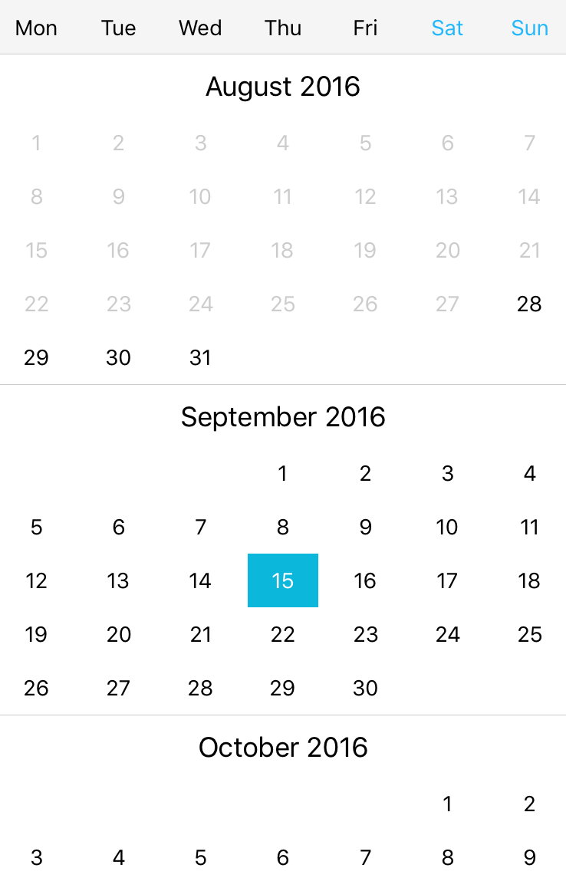

# React Native Calendar

A calendar component for React Native.



## Installation

```bash
npm install --save ivanzotov/react-native-calendar
```

## Example Usage

```javascript
import Calendar from 'react-native-calendar'
```

Add translation into your I18n.translations

```javascript
  date: {
    formats: {
      normal: "%e %B",
      day_month: "%-d %B",
      short: "%-d %b",
      full: "%-d %b %H:%M",
    },
    month_names: [null, 'January', 'February', 'March', 'April', 'May', 'June', 'July', 'August', 'September', 'October', 'November', 'December'],
    abbr_day_names: ["Sun", "Mon", "Tue", "Wed", "Thu", "Fri", "Sat"],
  }
```

Russian Example

```javascript
  date: {
    formats: {
      normal: "%e %B",
      day_month: "%-d %b",
      short: "%-d %b",
      full: "%-d %b %H:%M",
    },
    month_names: [null, 'Январь', 'Февраль', 'Март', 'Апрель', 'Май', 'Июнь', 'Июль', 'Август', 'Сентябрь', 'Октябрь', 'Ноябрь', 'Декабрь'],
    abbr_month_names: [null, 'янв.', 'февр.', 'марта', 'апр.', 'мая', 'июня', 'июля', 'авг.', 'сент.', 'окт.', 'нояб.', 'дек.'],
    abbr_day_names: ["Вс", "Пн", "Вт", "Ср", "Чт", "Пт", "Сб"],
  }
```

## License

MIT
